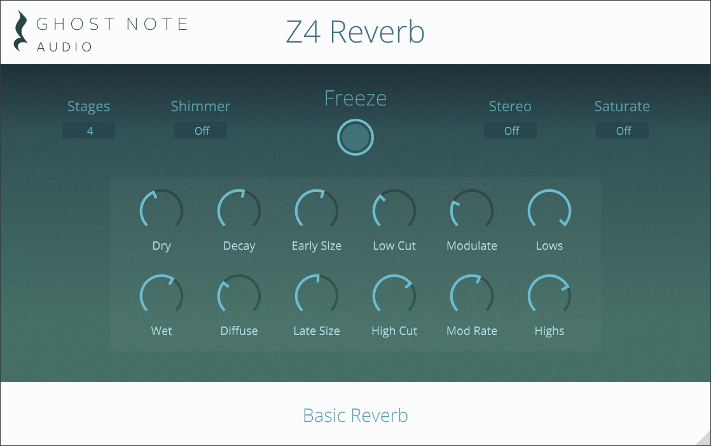

# Z4 Reverb

## To Build on Windows

1. Generate VS build files
2. Run `python patch_windows_build.py .\Builds\VisualStudio2022`
3. Run `msbuild /m /p:Configuration=Release .\Builds\VisualStudio2022\Z4Reverb.sln`
4. Run `"C:\Program Files (x86)\Inno Setup 6\iscc.exe" Packaging\InnoSetup.iss /DMyAppVersion=%VERSION%`

## Building on MacOS

    list all targets and schemes:
    xcodebuild -list -project Z4Reverb.xcodeproj

    xcodebuild -project Z4Reverb.xcodeproj -scheme "Z4Reverb - All" -destination 'platform=macOS' build

    curl http://s.sudre.free.fr/Software/files/Packages.dmg --output Packages.dmg
    hdiutil attach Packages.dmg
    sudo installer -package /Volumes/Packages\ 1.2.10/Install\ Packages.pkg -target /Applications 
    python patch_macos_packaging.py ${{VERSION}}
    packagesbuild -v "./Packaging/Packaging.pkgproj"